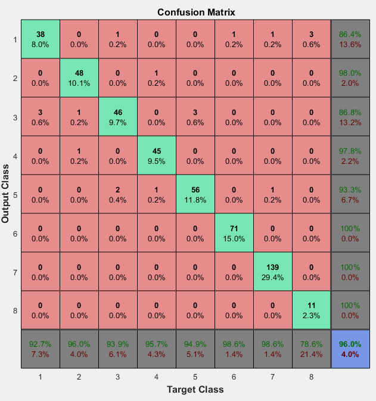

# MlSchool_SpeechPro
Для решения задачи классификации акустических событий было реализовано несколько классификаторов: GMM-UBM, GMM, i-vector, SVM. Первые три используют на ходе вектор из признаков: 20 MFC коэффициентов и энергия, 21 дельта-коэффициент, вероятность вокализации и частота пересечения нуля. В SVM классификаторе использованы статистики от этих признаков (средние и среднеквадратичное отклонение). 

Классификатор с наивысшей точностью на тестовых данных 	~0.96 основан на GMM-UBM подходе с количеством смесей 1024.

Детектор наличия факта события реализован не был.

Для воспроизведения результатов необходимо:
1. Извлечь признаки. Признаки извлекаются с помощью библиотеки [OpenSmile](http://opensmile.audeering.com/) (используется конфигурационный файл AudioFeatures.conf). Можно использовать PowerShell скрипт:

 Get-ChildItem -Path C:\Samples\data_v_7_stc -Recurse -Include *.wav | Foreach {$st = join-path ([system.io.fileinfo]$_).DirectoryName  ([system.io.fileinfo]$_).BaseName;  $st2 = $st+".htk"; E:\work\Aspirant\opensmile-2.3.0\bin\Win32\SMILExtract.exe -l 0 -C E:\work\ML\MlSchool_SpeechPro\MlSchool_SpeehPro\AudioFeatures.conf -I $_.fullname -O  $st2}
2. С помощью Matlab запустить скрипт gmm_classification_final.m. В первых строках кода указываются каталоги с данными.
